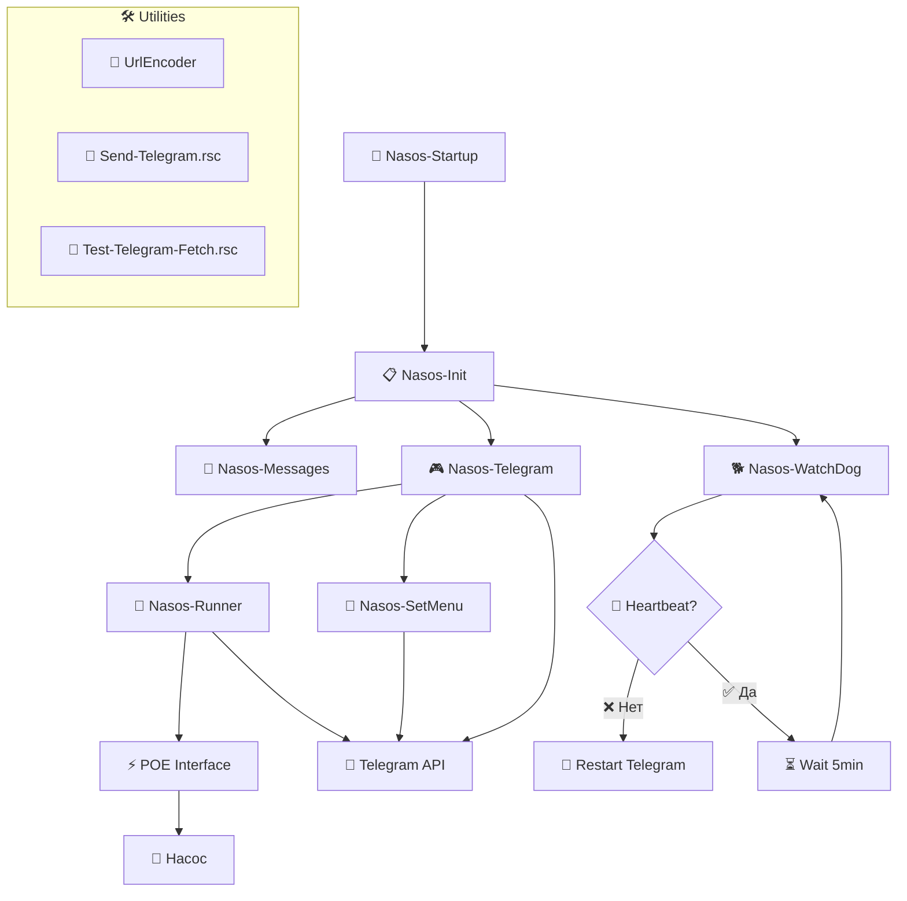

# 🚰 NasosRunner - Система управления насосом через Telegram

[](https://mikrotik.com/)
[](LICENSE)
[](https://python.org/)

> 🎯 **Автоматизированная система управления POE насосом через Telegram бот с функциями автозапуска, мониторинга и полного контроля состояния.**

---

## 📋 Содержание

- [🎯 Описание системы](#-описание-системы)
- [✨ Возможности](#-возможности)
- [🏗️ Архитектура](#️-архитектура)
- [📁 Структура проекта](#-структура-проекта)
- [🔧 Модули системы](#-модули-системы)
- [⚙️ Установка и настройка](#️-установка-и-настройка)
- [🎮 Команды управления](#-команды-управления)
- [📊 Мониторинг и диагностика](#-мониторинг-и-диагностика)
- [🔧 Устранение неполадок](#-устранение-неполадок)
- [🔒 Безопасность](#-безопасность)
- [📞 Поддержка](#-поддержка)

---

## 🎯 Описание системы

**NasosRunner** - это полнофункциональная система управления POE насосом на базе MikroTik RouterOS с интеграцией Telegram бота. Система обеспечивает надежное дистанционное управление, автоматизацию процессов и комплексный мониторинг состояния оборудования.

### 🚀 Ключевые особенности:
- **🔄 Автономная работа** - система полностью автоматическая после настройки
- **🛡️ Отказоустойчивость** - встроенная система восстановления при сбоях
- **📱 Простое управление** - интуитивный интерфейс через Telegram
- **⚡ Быстрый отклик** - моментальное выполнение команд
- **📊 Полный контроль** - детальная информация о состоянии системы

---

## ✨ Возможности

### 🎛️ Управление насосом:
- ⏱️ **Временные настройки** - запуск на 5, 10, 30, 60, 120 минут
- 🛑 **Мгновенная остановка** - аварийное отключение в любой момент
- 📊 **Мониторинг в реальном времени** - отображение текущего статуса
- ⚡ **Изменение времени** - корректировка продолжительности работы на лету

### 🔧 Автоматизация:
- 🚀 **Автозапуск** - восстановление работы после перезагрузки роутера
- ⏰ **Таймеры** - автоматическая остановка по истечении времени
- 🐕 **Watchdog** - мониторинг и перезапуск при зависании
- 🔄 **Самодиагностика** - автоматическая проверка компонентов

### 📱 Telegram интеграция:
- 🖥️ **Интерактивное меню** - удобная навигация по командам
- 📨 **Уведомления** - информирование о всех операциях
- 🎯 **Быстрые команды** - мгновенное выполнение действий
- 📊 **Детальная статистика** - полная информация о работе системы

---

## 🏗️ Архитектура



---

## 📁 Структура проекта

```
NasosRunner/
├── 📚 Doc/                           # Документация проекта
│   ├── mikrotik-syntax-rules.md      # Правила синтаксиса RouterOS
│   └── project-structure.md          # Структура проекта
├── 💾 Rezerv/                        # Резервные копии (01-07)
│   ├── 01/ ... 07/                   # Версии разработки
│   └── Codind/                       # Экспериментальные модули
├── 🔗 UrlEncoder/                    # Утилита кодирования URL
│   ├── UrlEncoder.py                 # GUI приложение Python
│   └── requirements.txt              # Зависимости Python
├── 🚀 Nasos-Startup.rsc             # Автозапуск системы
├── 📋 Nasos-Init.rsc                # Инициализация переменных
├── 💬 Nasos-Messages.rsc            # Текстовые сообщения
├── 🎮 Nasos-Telegram.rsc            # Обработка команд Telegram
├── 🔄 Nasos-Runner.rsc              # Основной движок управления
├── 📱 Nasos-SetMenu.rsc             # Настройка меню бота
├── 🐕 Nasos-WatchDog.rsc            # Мониторинг системы
├── 📤 Send-Telegram.rsc             # Тестовый модуль отправки
├── 🧪 Test-Telegram-Fetch.rsc       # Тестовый модуль получения
└── 📖 README.md                     # Основная документация
```

---

## 🔧 Модули системы

### 🚀 Nasos-Startup.rsc
**Назначение:** Автоматическая конфигурация системы при загрузке роутера

**Функции:**
- 🔧 Инициализация всех компонентов системы
- ⏰ Создание scheduler'ов для автозапуска
- 📨 Отправка уведомления о перезагрузке
- 🧹 Очистка предыдущих конфигураций

**Создаваемые задачи:**
- `nasos-telegram-startup` - запуск Telegram модуля через 1 минуту
- `nasos-watchdog-timer` - запуск WatchDog через 1.5 минуты с интервалом 5 минут

### 📋 Nasos-Init.rsc
**Назначение:** Инициализация глобальных переменных и базовых настроек

**Глобальные переменные:**
```routeros
:global NasosInitStatus           # Статус инициализации
:global PoeMainInterface "E5-Nasos"  # POE интерфейс насоса
:global BotToken "ТОКЕН_БОТА"    # Токен Telegram бота
:global ChatId "CHAT_ID"         # ID чата для уведомлений
:global PoeActiveTimer           # Активный таймер насоса
:global PoeStartTime             # Время запуска насоса
:global NewDuration              # Новая продолжительность работы
:global TelegramHeartbeat        # Heartbeat Telegram модуля
:global LastUpdateId             # ID последнего обновления
:global LastStopTime             # Время последней остановки
```

**Функции:**
- ⚡ Отключение POE после перезагрузки (безопасность)
- 🧹 Очистка старых таймеров
- 📨 Загрузка модуля сообщений
- ✅ Установка флага успешной инициализации

### 💬 Nasos-Messages.rsc
**Назначение:** Централизованное хранение всех текстовых сообщений

**Категории сообщений:**
- 🖥️ **Системные сообщения** - статусы запуска, ошибки, предупреждения
- 🚰 **Статусы насоса** - включен, выключен, работает, остановлен
- 📱 **Команды меню** - описания кнопок Telegram бота
- ⏰ **Время и таймеры** - форматирование времени работы
- 🐕 **WatchDog сообщения** - уведомления о перезапуске

**Особенности:**
- 🌐 URL-кодированные сообщения для корректного отображения
- 📝 Поддержка кириллицы и эмодзи
- 🎨 Красивое форматирование с использованием символов

### 🎮 Nasos-Telegram.rsc
**Назначение:** Основной модуль обработки команд Telegram

**Функциональность:**
- 🔄 Непрерывный цикл мониторинга Telegram API
- 📥 Обработка входящих команд (`/start5`, `/stop`, `/status`, etc.)
- 💓 Heartbeat для контроля работоспособности
- 📱 Автоматическая настройка меню бота
- 📊 Детальная статистика работы насоса

**Поддерживаемые команды:**
```
/start5   → 5 минут работы
/start10  → 10 минут работы  
/start30  → 30 минут работы
/start60  → 1 час работы
/start120 → 2 часа работы
/stop     → Остановка насоса
/status   → Текущий статус
/menu     → Показать меню
```

### 🔄 Nasos-Runner.rsc
**Назначение:** Основной движок управления насосом

**Ключевые возможности:**
- ⚡ Управление POE интерфейсом (включение/выключение)
- ⏰ Создание и управление таймерами автоостановки
- 📊 Расчет времени работы и статистики
- 📨 Отправка уведомлений о всех операциях
- 🔧 Обработка изменения времени работы на лету

**Алгоритм работы:**
1. Проверка инициализации системы
2. Валидация параметров (токен, chat_id, интерфейс)
3. Обработка команды (запуск/остановка/изменение времени)
4. Создание/удаление таймеров
5. Отправка уведомлений в Telegram

### 📱 Nasos-SetMenu.rsc
**Назначение:** Настройка интерактивного меню Telegram бота

**Функции:**
- 🧹 Очистка старого меню для всех scope
- 📱 Создание нового меню с командами
- 🌐 Установка меню для разных типов чатов
- 📝 Использование локализованных описаний команд

### 🐕 Nasos-WatchDog.rsc
**Назначение:** Мониторинг работоспособности системы

**Контролируемые параметры:**
- 💓 **Heartbeat** - проверка активности Telegram модуля
- ⏰ **Timeout** - перезапуск при отсутствии активности > 10 минут
- 🔄 **Auto-restart** - автоматический перезапуск зависших процессов

**Алгоритм работы:**
1. Проверка времени последнего heartbeat
2. Расчет времени бездействия
3. При превышении лимита - остановка процесса
4. Запуск нового экземпляра Telegram модуля
5. Отправка уведомления о перезапуске

### 🔗 UrlEncoder
**Назначение:** Утилита для кодирования текста в URL-формат

**Возможности:**
- 🎨 Графический интерфейс на Python/Tkinter
- 📝 Поддержка кириллицы и эмодзи
- 📋 Работа с буфером обмена
- 🌈 Большая коллекция эмодзи для Telegram
- ⚡ Быстрое кодирование/декодирование

---

## ⚙️ Установка и настройка

### 📋 Требования

**Аппаратные:**
- 🖥️ MikroTik роутер с RouterOS v7.0+
- ⚡ POE порт для подключения насоса
- 🌐 Интернет соединение (HTTPS доступ к api.telegram.org)

**Программные:**
- 🔑 Telegram бот токен (получить у [@BotFather](https://t.me/botfather))
- 👤 Chat ID для получения уведомлений
- 🖥️ Доступ к консоли RouterOS (SSH/WinBox/Webfig)

### 🚀 Пошаговая установка

#### 1️⃣ Создание Telegram бота

```
1. Напишите @BotFather в Telegram
2. Отправьте команду: /newbot
3. Укажите имя бота: NasosRunner Bot
4. Укажите username: @nasos_runner_bot
5. Сохраните полученный токен
```

#### 2️⃣ Получение Chat ID

```
1. Напишите боту любое сообщение
2. Откройте: https://api.telegram.org/bot<ВАШ_ТОКЕН>/getUpdates
3. Найдите "chat":{"id":XXXXXXXXX в ответе
4. Сохраните значение ID
```

#### 3️⃣ Настройка параметров

Отредактируйте в `Nasos-Init.rsc`:

```routeros
# Основные переменные
:global PoeMainInterface "E5-Nasos"                    # Ваш POE интерфейс
:global BotToken "1234567890:AAHxxxxxxxxxxxxxxxxx"      # Ваш токен бота  
:global ChatId "123456789"                              # Ваш Chat ID
```

#### 4️⃣ Загрузка модулей

**Через WinBox/Webfig:**
```
System → Scripts → + (Add New)
- Скопируйте содержимое каждого .rsc файла
- Установите права: read,write,policy,test,sensitive,reboot
```

**Через SSH:**
```bash
# Загрузите файлы на роутер и выполните:
/system script
add name="Nasos-Startup" source=[/file get Nasos-Startup.rsc contents] policy=ftp,reboot,read,write,policy,test,password,sniff,sensitive,romon
add name="Nasos-Init" source=[/file get Nasos-Init.rsc contents] policy=ftp,reboot,read,write,policy,test,password,sniff,sensitive,romon
add name="Nasos-Messages" source=[/file get Nasos-Messages.rsc contents] policy=ftp,reboot,read,write,policy,test,password,sniff,sensitive,romon
add name="Nasos-Telegram" source=[/file get Nasos-Telegram.rsc contents] policy=ftp,reboot,read,write,policy,test,password,sniff,sensitive,romon
add name="Nasos-Runner" source=[/file get Nasos-Runner.rsc contents] policy=ftp,reboot,read,write,policy,test,password,sniff,sensitive,romon
add name="Nasos-SetMenu" source=[/file get Nasos-SetMenu.rsc contents] policy=ftp,reboot,read,write,policy,test,password,sniff,sensitive,romon
add name="Nasos-WatchDog" source=[/file get Nasos-WatchDog.rsc contents] policy=ftp,reboot,read,write,policy,test,password,sniff,sensitive,romon
```

#### 5️⃣ Первый запуск

```routeros
# 1. Запустите конфигурацию системы
/system script run Nasos-Startup

# 2. Проверьте созданные задачи
/system scheduler print where name~"nasos"

# 3. Проверьте инициализацию
:global NasosInitStatus; :put $NasosInitStatus

# 4. Отправьте команду /menu боту в Telegram
```

---

## 🎮 Команды управления

### 📱 Telegram команды

| Команда | Описание | Время работы |
|---------|----------|--------------|
| 5️⃣ `/start5` | Включить насос | 5 минут |
| 🔟 `/start10` | Включить насос | 10 минут |
| 3️⃣0️⃣ `/start30` | Включить насос | 30 минут |
| 6️⃣0️⃣ `/start60` | Включить насос | 1 час |
| 1️⃣2️⃣0️⃣ `/start120` | Включить насос | 2 часа |
| 🛑 `/stop` | Остановить насос | Мгновенно |
| 👁️ `/status` | Показать статус | - |
| 📜 `/menu` | Показать меню | - |

### 🖥️ Консольные команды

#### 🔍 Мониторинг системы:
```routeros
# Статус активных скриптов
/system script job print

# Логи системы (последние 20 записей)
/log print where message~"Насос" count=20

# Статус scheduler'ов
/system scheduler print where name~"nasos"

# Heartbeat состояние
:global TelegramHeartbeat; :put ("Последний heartbeat: " . $TelegramHeartbeat)

# Статус POE интерфейса
:global PoeMainInterface; /interface ethernet get [find name=$PoeMainInterface] poe-out

# Активные переменные
:global PoeActiveTimer; :put ("Активный таймер: " . $PoeActiveTimer)
:global PoeStartTime; :put ("Время запуска: " . $PoeStartTime)
```

#### 🛠️ Управление системой:
```routeros
# Перезапуск Telegram модуля
/system script job remove [find script="Nasos-Telegram"]
/system script run Nasos-Telegram

# Перезапуск всей системы
/system script run Nasos-Startup

# Остановка всех процессов
/system script job remove [find script~"Nasos"]
```

---

## 📊 Мониторинг и диагностика

### ✅ Индикаторы нормальной работы:

- 💚 **Heartbeat обновляется** каждые 4 секунды
- 📨 **Команды выполняются** мгновенно
- 🔄 **Логи пишутся** при каждой операции
- ⚡ **POE интерфейс** реагирует на команды

### ⚠️ Возможные проблемы:

#### 🔴 Telegram не отвечает
**Симптомы:** Команды не выполняются, heartbeat устарел
```routeros
# Проверка heartbeat
:global TelegramHeartbeat; :put $TelegramHeartbeat
# Если время > 10 минут назад - система зависла
```

**Решение:**
```routeros
# Принудительный перезапуск
/system script job remove [find script="Nasos-Telegram"]
/system script run Nasos-Telegram
```

#### 🔴 Насос не реагирует
**Симптомы:** Команды выполняются, но POE не переключается
```routeros
# Проверка POE интерфейса
:global PoeMainInterface
/interface ethernet print where name=$PoeMainInterface
/interface ethernet get [find name=$PoeMainInterface] poe-out
```

**Решение:**
```routeros
# Проверка питания и переключение
/interface ethernet poe power-cycle $PoeMainInterface
:delay 2s
/interface ethernet poe set $PoeMainInterface poe-out=forced-on
```

#### 🔴 Отсутствуют scheduler'ы
**Симптомы:** Система не запускается автоматически
```routeros
# Проверка
/system scheduler print where name~"nasos"
```

**Решение:**
```routeros
# Пересоздание
/system scheduler remove [find name~"nasos"]
/system script run Nasos-Startup
```

---

## 🔧 Устранение неполадок

### 🚨 Экстренное восстановление

#### 1️⃣ Полная остановка системы:
```routeros
# Остановка всех процессов
/system script job remove [find script~"Nasos"]

# Отключение насоса
:global PoeMainInterface
/interface ethernet poe set $PoeMainInterface poe-out=off

# Удаление всех таймеров
/system scheduler remove [find name~"nasos"]
/system scheduler remove [find name~"poe-timer"]
```

#### 2️⃣ Сброс переменных:
```routeros
# Очистка глобальных переменных
:global PoeActiveTimer; :set PoeActiveTimer ""
:global PoeStartTime; :set PoeStartTime ""
:global NewDuration; :set NewDuration ""
:global NasosInitStatus; :set NasosInitStatus false
```

#### 3️⃣ Полный перезапуск:
```routeros
# Запуск инициализации
/system script run Nasos-Startup

# Ожидание 2 минуты для полной загрузки
:delay 2m

# Проверка состояния
/system scheduler print where name~"nasos"
/system script job print where script~"Nasos"
```

### 🔍 Диагностические команды

```routeros
# === БАЗОВАЯ ДИАГНОСТИКА ===

# 1. Проверка инициализации
:global NasosInitStatus; :put ("Инициализация: " . $NasosInitStatus)

# 2. Проверка подключения к Telegram
/tool fetch url="https://api.telegram.org/bot$BotToken/getMe" keep-result=yes
/file print where name="urldata"

# 3. Проверка POE интерфейса
:global PoeMainInterface
/interface ethernet print detail where name=$PoeMainInterface

# 4. Проверка последних логов
/log print where topics~"script" count=10

# 5. Проверка системного времени
/system clock print

# === ДЕТАЛЬНАЯ ДИАГНОСТИКА ===

# 6. Статус всех глобальных переменных
:foreach var in={"NasosInitStatus";"BotToken";"ChatId";"PoeMainInterface";"PoeActiveTimer";"PoeStartTime";"TelegramHeartbeat"} do={
    :local value [(:parse (":global " . $var . "; :return \$" . $var))]
    :put ($var . ": " . $value)
}

# 7. Проверка прав скриптов
/system script print detail where name~"Nasos"

# 8. Проверка активных scheduler'ов
/system scheduler print detail where name~"nasos"
```

---

## 🔒 Безопасность

### 🛡️ Рекомендации по безопасности:

#### 🔐 Защита токенов:
- 🔑 Используйте уникальные токены для каждой установки
- 🔄 Регулярно обновляйте токены (раз в 6 месяцев)
- 📝 Не сохраняйте токены в открытом виде в конфигурациях
- 🚫 Ограничьте доступ к Telegram боту только авторизованным пользователям

#### 🌐 Сетевая безопасность:
- 🔒 Используйте только HTTPS соединения с Telegram API
- 🚪 Ограничьте исходящие соединения только к api.telegram.org:443
- 🛡️ Настройте файрвол для блокировки нежелательного трафика
- 📊 Мониторьте сетевую активность системы

#### 🖥️ Безопасность RouterOS:
- 👤 Используйте отдельного пользователя для скриптов с минимальными правами
- 🔐 Регулярно обновляйте RouterOS до последней версии
- 📋 Ведите журнал всех изменений в системе
- 💾 Настройте автоматическое резервное копирование

### 🚨 Мониторинг безопасности:

```routeros
# Проверка подозрительной активности
/log print where topics~"script" and message~"error"

# Мониторинг исходящих соединений
/tool torch interface=ether1 port=443

# Проверка последних изменений
/system history print
```

---

## 📞 Поддержка

### 📧 Контакты:
- **Telegram:** [@support_nasos](https://t.me/support_nasos)
- **Email:** nasos.support@example.com
- **GitHub Issues:** [Issues](https://github.com/user/NasosRunner/issues)

### 📚 Дополнительные ресурсы:
- 📖 **Wiki:** [Полная документация](https://github.com/user/NasosRunner/wiki)
- 🎥 **Видео-инструкции:** [YouTube канал](https://youtube.com/NasosRunner)
- 💬 **Сообщество:** [Telegram чат](https://t.me/nasos_runner_chat)
- 🐛 **Багрепорты:** [GitHub Issues](https://github.com/user/NasosRunner/issues/new)

### ❓ FAQ:

<details>
<summary><strong>❓ Можно ли использовать несколько насосов?</strong></summary>

Да, можно создать несколько экземпляров системы для разных POE интерфейсов. Для этого нужно:
1. Создать отдельные переменные для каждого насоса
2. Использовать разные имена скриптов  
3. Настроить отдельных Telegram ботов
</details>

<details>
<summary><strong>❓ Что делать при частых перезапусках WatchDog?</strong></summary>

Частые перезапуски обычно указывают на:
1. Проблемы с интернет соединением
2. Блокировку Telegram API провайдером
3. Высокую нагрузку на роутер
4. Ошибки в коде скриптов

Проверьте логи и сетевое соединение.
</details>

<details>
<summary><strong>❓ Можно ли изменить интервалы времени?</strong></summary>

Да, в модуле `Nasos-Telegram.rsc` можно изменить значения:
- `:set NewDuration 300` (5 минут = 300 секунд)
- `:set NewDuration 600` (10 минут = 600 секунд)
- И так далее...
</details>

---

## 📄 Лицензия

```
MIT License

Copyright (c) 2024 NasosRunner

Permission is hereby granted, free of charge, to any person obtaining a copy
of this software and associated documentation files (the "Software"), to deal
in the Software without restriction, including without limitation the rights
to use, copy, modify, merge, publish, distribute, sublicense, and/or sell
copies of the Software, and to permit persons to whom the Software is
furnished to do so, subject to the following conditions:

The above copyright notice and this permission notice shall be included in all
copies or substantial portions of the Software.

THE SOFTWARE IS PROVIDED "AS IS", WITHOUT WARRANTY OF ANY KIND, EXPRESS OR
IMPLIED, INCLUDING BUT NOT LIMITED TO THE WARRANTIES OF MERCHANTABILITY,
FITNESS FOR A PARTICULAR PURPOSE AND NONINFRINGEMENT. IN NO EVENT SHALL THE
AUTHORS OR COPYRIGHT HOLDERS BE LIABLE FOR ANY CLAIM, DAMAGES OR OTHER
LIABILITY, WHETHER IN AN ACTION OF CONTRACT, TORT OR OTHERWISE, ARISING FROM,
OUT OF OR IN CONNECTION WITH THE SOFTWARE OR THE USE OR OTHER DEALINGS IN THE
SOFTWARE.
```

---

<div align="center">

**🎯 NasosRunner v2.0 - Надежное управление насосом через Telegram**

[](https://github.com/user/NasosRunner)
[](https://mikrotik.com/)

*Система готова к эксплуатации! 🚀*

</div> 