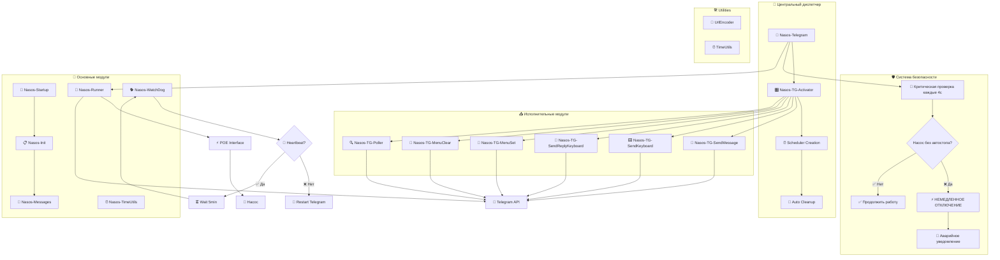

# 🚰 NasosRunner - Система управления насосом через Telegram

[](https://mikrotik.com/)
[](LICENSE)
[](https://python.org/)

> 🎯 **Революционная система управления POE насосом через Telegram бот с модульной архитектурой диспетчера, критической защитой безопасности, автозапуском, мониторингом и полным контролем состояния.**

---

## 📋 Содержание

- [🎯 Описание системы](#-описание-системы)
- [✨ Возможности](#-возможности)
- [🛡️ Система безопасности](#️-система-безопасности)
- [🏗️ Архитектура](#️-архитектура)
- [📁 Структура проекта](#-структура-проекта)
- [🔧 Модули системы](#-модули-системы)
- [⚙️ Установка и настройка](#️-установка-и-настройка)
- [🎮 Команды управления](#-команды-управления)
- [📊 Мониторинг и диагностика](#-мониторинг-и-диагностика)
- [🔧 Устранение неполадок](#-устранение-неполадок)
- [🔒 Безопасность](#-безопасность)
- [📞 Поддержка](#-поддержка)

---

## 🎯 Описание системы

**NasosRunner** - это полнофункциональная система управления POE насосом на базе MikroTik RouterOS с интеграцией Telegram бота. Система построена на революционной модульной архитектуре с центральным диспетчером и критической защитой безопасности, обеспечивающим надежное дистанционное управление, автоматизацию процессов и комплексный мониторинг состояния оборудования.

### 🚀 Ключевые особенности:
- **🛡️ Критическая защита** - немедленное отключение при отсутствии автостопа
- **🎛️ Модульная архитектура** - изолированные модули с центральным диспетчером
- **⚡ Асинхронное выполнение** - отказоустойчивая система scheduler'ов
- **🔄 Автономная работа** - система полностью автоматическая после настройки
- **🛡️ Отказоустойчивость** - встроенная система восстановления при сбоях
- **📱 Интерактивное управление** - богатый интерфейс с inline и reply клавиатурами
- **📊 Полный контроль** - детальная информация о состоянии системы

---

## ✨ Возможности

### 🎛️ Управление насосом:
- ⏱️ **Универсальная команда** - `/start X` для любого количества минут
- 🛑 **Мгновенная остановка** - аварийное отключение в любой момент
- 📊 **Мониторинг в реальном времени** - отображение текущего статуса
- ⚡ **Изменение времени** - корректировка продолжительности работы на лету
- ➖ **Уменьшение времени** - `/start -X` для сокращения работы

### 🔧 Автоматизация:
- 🚀 **Автозапуск** - восстановление работы после перезагрузки роутера
- ⏰ **Таймеры** - автоматическая остановка по истечении времени
- 🐕 **Watchdog** - мониторинг и перезапуск при зависании
- 🔄 **Самодиагностика** - автоматическая проверка компонентов
- ⏰ **TimeUtils** - централизованное форматирование временных интервалов

### 📱 Telegram интеграция:
- 🎯 **Отказоустойчивый опрос** - безопасная работа с Telegram API
- 🖥️ **Интерактивное меню** - команды бота с описаниями
- ⌨️ **Inline клавиатуры** - кнопки прикрепленные к сообщениям
- 📱 **Reply клавиатуры** - постоянные кнопки внизу чата
- 📨 **Уведомления** - информирование о всех операциях
- 📊 **Детальная статистика** - полная информация о работе системы

---

## 🛡️ Система безопасности

### 🚨 Критическая защита от работы без автостопа

**Проблема:** Насос может остаться работать бесконечно при сбое таймера автостопа, что критично для оборудования.

**Решение:** Постоянный мониторинг каждые 4 секунды в основном цикле:

```routeros
# КРИТИЧЕСКАЯ ПРОВЕРКА в каждом цикле
:local poeStatus [/interface ethernet poe get $PoeMainInterface poe-out]
:if ($poeStatus = "auto-on" || $poeStatus = "forced-on") do={
    :if ([:len $PoeActiveTimer] = 0 || [:len [/system scheduler find name=$PoeActiveTimer]] = 0) do={
        # НЕМЕДЛЕННОЕ ОТКЛЮЧЕНИЕ
        /interface ethernet poe set $PoeMainInterface poe-out=off
        # КРИТИЧЕСКОЕ УВЕДОМЛЕНИЕ
        :log error "КРИТИЧНО: Насос работает без автостопа - принудительное отключение!"
    }
}
```

**Действия системы при обнаружении:**
1. 🚨 **Немедленное отключение** - насос выключается мгновенно
2. 📊 **Расчет времени работы** - сохранение статистики аварийной работы  
3. 📱 **Критическое уведомление** - отправка в Telegram
4. 🧹 **Очистка переменных** - сброс всех состояний
5. 📝 **Логирование ошибки** - запись в системный лог

**Формат уведомления:**
```
❌ Ошибка: АВАРИЙНОЕ ОТКЛЮЧЕНИЕ!
Причина: Отсутствие автостопа
⏱️ Работал: 15 мин. 30 сек.
```

### 🔒 Дополнительные меры безопасности

- **🛡️ Валидация времени** - проверка корректности всех временных значений
- **🔄 Защита от ошибок** - `on-error` обработка всех критических операций
- **📊 Двойная проверка** - контроль существования переменных и scheduler'ов
- **⚡ Fallback сообщения** - резервные тексты при ошибках форматирования

---

## 🏗️ Архитектура

### 🎛️ Революционная архитектура с критической защитой



### 🎛️ Принцип работы диспетчера:

1. **📥 Получение команды** - Telegram модуль получает команду от пользователя
2. **🎯 Установка параметров** - Устанавливаются глобальные переменные (TgAction, TgMessage, etc.)
3. **🚀 Активация диспетчера** - Запускается Nasos-TG-Activator
4. **⏰ Создание scheduler** - Создается уникальный scheduler для выполнения
5. **🎭 Выбор исполнителя** - Диспетчер определяет нужный модуль по TgAction
6. **⚡ Выполнение** - Исполнительный модуль выполняет задачу
7. **🧹 Очистка** - Автоматическая очистка переменных и scheduler'а

---

## 📁 Структура проекта

```
NasosRunner/
├── 📚 Doc/                              # Документация проекта
│   ├── mikrotik-syntax-rules.md         # Правила синтаксиса RouterOS
│   ├── project-structure.md             # Структура проекта
│   ├── BestPractice-Telegram-SafeFetch.md # Лучшие практики API
│   ├── History-Telegram-Integration.md   # История интеграции Telegram
│   └── History-TimeUtils-Integration.md  # История интеграции TimeUtils
├── 💾 Rezerv/                           # Резервные копии
├── 🧪 Test/                             # Тестовые модули
├── 🔗 UrlEncoder/                       # Утилита кодирования URL
│   ├── UrlEncoder.py                    # GUI приложение Python
│   └── requirements.txt                 # Зависимости Python
├── 🚀 Nasos-Startup.rsc                # Автозапуск системы
├── 📋 Nasos-Init.rsc                   # Инициализация переменных
├── 💬 Nasos-Messages.rsc               # Текстовые сообщения
├── 📱 Nasos-Telegram.rsc               # Обработка команд Telegram
├── 🔄 Nasos-Runner.rsc                 # Основной движок управления
├── ⏰ Nasos-TimeUtils.rsc              # Форматирование времени
├── 🐕 Nasos-WatchDog.rsc               # Мониторинг системы
├── 🎛️ Nasos-TG-Activator.rsc          # Центральный диспетчер
├── 📨 Nasos-TG-SendMessage.rsc         # Отправка простых сообщений
├── ⌨️ Nasos-TG-SendKeyboard.rsc        # Inline клавиатуры
├── 📱 Nasos-TG-SendReplyKeyboard.rsc   # Reply клавиатуры
├── 🔧 Nasos-TG-MenuSet.rsc             # Установка меню бота
├── 🧹 Nasos-TG-MenuClear.rsc           # Очистка меню бота
├── 🔍 Nasos-TG-Poller.rsc              # Безопасный опрос Telegram API
└── 📖 README.md                        # Основная документация
```

---

## 🔧 Модули системы

### 🎛️ Nasos-TG-Activator.rsc (Центральный диспетчер)
**Назначение:** Революционная система управления Telegram операциями

**Принцип работы:**
- 🎯 Получает параметры через глобальные переменные
- ⏰ Создает уникальные scheduler с timestamp
- 🚀 Запускает соответствующие исполнительные модули
- 🧹 Автоматически очищает старые scheduler'ы
- ⚡ Гарантирует выполнение через 1 секунду

**Поддерживаемые действия:**
```routeros
TgAction = "send"          → Nasos-TG-SendMessage
TgAction = "keyboard"      → Nasos-TG-SendKeyboard  
TgAction = "replykeyboard" → Nasos-TG-SendReplyKeyboard
TgAction = "set"           → Nasos-TG-MenuSet
TgAction = "clear"         → Nasos-TG-MenuClear
```

**Глобальные переменные для связи:**
```routeros
:global TgAction          # Тип действия
:global TgMessage         # Текст сообщения
:global TgKeyboardType    # Тип клавиатуры
:global TgCleanupTime     # Время жизни scheduler (по умолчанию 10s)
```

### 📱 Nasos-Telegram.rsc (v4.0 - Критическая защита)
**Назначение:** Основной модуль обработки команд с критической защитой безопасности

**Новые возможности v4.0:**
- 🛡️ **Критическая проверка** - мониторинг автостопа каждые 4 секунды
- 🔍 **Отказоустойчивый опрос** - делегирование API через TG-Poller
- ⚡ **Универсальная команда** - `/start X` для любого количества минут
- 📊 **Защита от ошибок** - комплексная валидация всех операций

**Поддерживаемые команды:**
```
/start X   → X минут работы (любое число от 1 до 999)
/start 0   → Остановка насоса  
/start -X  → Уменьшение времени на X минут
/stop      → Остановка насоса
/status    → Текущий статус с защитой от ошибок
/menu      → Показать меню команд
```

**Архитектура безопасности:**
```routeros
# Постоянная критическая проверка в цикле
:while (true) do={
    # 1. Обновление heartbeat
    :set TelegramHeartbeat [/system clock get time]
    
    # 2. КРИТИЧЕСКАЯ ПРОВЕРКА
    :local poeStatus [/interface ethernet poe get $PoeMainInterface poe-out]
    :if ($poeStatus = "auto-on" || $poeStatus = "forced-on") do={
        :if ([:len $PoeActiveTimer] = 0 || [:len [/system scheduler find name=$PoeActiveTimer]] = 0) do={
            # АВАРИЙНОЕ ОТКЛЮЧЕНИЕ
        }
    }
    
    # 3. Безопасный опрос API
    # 4. Обработка команд с защитой
    # 5. Пауза 4 секунды
}
```

### 🔍 Nasos-TG-Poller.rsc (НОВЫЙ модуль)
**Назначение:** Безопасный опрос Telegram API с обработкой ошибок

**Функции:**
- 📡 **Безопасный API опрос** - обработка всех ошибок сети/API
- 🔍 **Парсинг команд** - извлечение команд из JSON ответа
- ⚡ **Универсальный парсер** - поддержка `/start X` и `start X`
- 📊 **Глобальные переменные** - передача данных в основной модуль

**Глобальные переменные для связи:**
```routeros
:global TgPollStatus      # "ok" | "error" | "no_updates"
:global TgPollError       # Текст ошибки при сбое
:global TgLastCommand     # Последняя команда пользователя
:global TgStartMinutes    # Количество минут для команды start
```

### 📨 Nasos-TG-SendMessage.rsc
**Назначение:** Отправка простых текстовых сообщений

**Функции:**
- 📤 Отправка URL-кодированных сообщений
- 🔍 Проверка наличия токена и chat_id
- 📝 Логирование всех операций
- 🧹 Автоочистка глобальных переменных

### ⌨️ Nasos-TG-SendKeyboard.rsc
**Назначение:** Отправка сообщений с inline клавиатурами

**Поддерживаемые типы:**
- **main** - Основное меню управления насосом
- **confirm** - Кнопки подтверждения (Да/Нет)
- **time** - Выбор времени работы (5мин, 10мин, 30мин, 1час, 2часа)

**Особенности:**
- 🎨 Красивые эмодзи иконки
- 📱 Адаптивная компоновка кнопок
- ⚡ Callback данные для быстрого отклика

### 📱 Nasos-TG-SendReplyKeyboard.rsc
**Назначение:** Управление постоянной клавиатурой внизу чата

**Поддерживаемые типы:**
- **main** - Основные команды управления
- **simple** - Упрощенное меню (Старт/Стоп/Статус)
- **time** - Быстрый выбор времени
- **hide** - Скрытие клавиатуры

**Преимущества:**
- 🔄 Постоянно доступные кнопки
- 📱 Удобство для частых команд
- 🎯 Быстрый доступ к функциям

### 🔧 Nasos-TG-MenuSet.rsc
**Назначение:** Установка меню команд бота

**Функции:**
- 🌐 Установка для всех scope (default, all_private_chats, all_group_chats)
- 📝 Локализованные описания команд
- ⏱️ Задержки для корректной обработки API
- 🔄 Поддержка обновления меню

### 🧹 Nasos-TG-MenuClear.rsc
**Назначение:** Очистка меню команд бота

**Функции:**
- 🗑️ Очистка для всех scope
- ⚡ Быстрое удаление старых меню
- 🔄 Подготовка к установке нового меню

### ⏰ Nasos-TimeUtils.rsc
**Назначение:** Централизованное форматирование временных интервалов

**Архитектура:**
```routeros
# Входные данные
:global InputSeconds      # Количество секунд для форматирования

# Выходные данные  
:global FormattedLog      # Обычный русский текст для логов
:global FormattedTelegram # URL-кодированный текст для Telegram API
```

**Принцип работы:**
```routeros
# 1. Установка времени в секундах
:set InputSeconds 330

# 2. Запуск модуля форматирования  
/system script run Nasos-TimeUtils

# 3. Использование результата
:log info ("Время работы: " . $FormattedLog)
# Отправка в Telegram
:global TgAction "send"
:global TgMessage ("Работал: " . $FormattedTelegram)
/system script run Nasos-TG-Activator
```

**Примеры форматирования:**
| Секунды | FormattedLog | Применение |
|---------|--------------|------------|
| 30      | "30 сек."    | Короткие интервалы |
| 300     | "5 мин."     | Средние интервалы |
| 330     | "5 мин. 30 сек." | Комбинированные |
| 3600    | "1 час"      | Длинные интервалы |

**Преимущества:**
- ⚡ Единообразное форматирование во всех модулях
- 🌐 Автоматическое URL-кодирование кириллицы
- 🎯 Простая архитектура: установка → запуск → использование
- 🧹 Отсутствие "хвостов" типа "0 секунд"

### 🚀 Nasos-Startup.rsc
**Назначение:** Автоматическая конфигурация системы при загрузке роутера

**Функции:**
- 🔧 Инициализация всех компонентов системы
- ⏰ Создание scheduler'ов для автозапуска
- 📨 Отправка уведомления о перезагрузке через диспетчер
- 🧹 Очистка предыдущих конфигураций

**Создаваемые задачи:**
- `nasos-telegram-startup` - запуск Telegram модуля через 1 минуту
- `nasos-watchdog-timer` - запуск WatchDog через 1.5 минуты с интервалом 5 минут

### 📋 Nasos-Init.rsc
**Назначение:** Инициализация глобальных переменных и базовых настроек

**Глобальные переменные:**
```routeros
# Основные настройки
:global NasosInitStatus           # Статус инициализации
:global PoeMainInterface "E5-Nasos"  # POE интерфейс насоса
:global BotToken "ТОКЕН_БОТА"    # Токен Telegram бота
:global ChatId "CHAT_ID"         # ID чата для уведомлений

# Управление насосом
:global PoeActiveTimer           # Активный таймер насоса
:global PoeStartTime             # Время запуска насоса
:global NewDuration              # Новая продолжительность работы
:global LastStopTime             # Время последней остановки
:global LastWorkDuration         # Длительность последней работы (секунды)

# Telegram интеграция
:global TelegramHeartbeat        # Heartbeat Telegram модуля
:global LastUpdateId             # ID последнего обновления

# Диспетчер переменные
:global TgAction                 # Тип действия диспетчера
:global TgMessage                # Сообщение для отправки
:global TgKeyboardType           # Тип клавиатуры
:global TgCleanupTime            # Время жизни scheduler

# Форматирование времени
:global InputSeconds             # Входные секунды
:global FormattedLog             # Форматированное время (лог)
:global FormattedTelegram        # Форматированное время (Telegram)
```

### 💬 Nasos-Messages.rsc (Обновлено)
**Назначение:** Централизованное хранение всех текстовых сообщений

**Новые переменные безопасности:**
```routeros
# Аварийные сообщения
:global MsgEmergencyShutdown    # "АВАРИЙНОЕ ОТКЛЮЧЕНИЕ!"
:global MsgEmergencyReason      # "Причина: Отсутствие автостопа"
```

**Исправления кодировки:**
- ✅ Исправлен `MsgPumpAutoStop` - убран лишний `%`
- ✅ Исправлен `MsgPumpStoppedByCmd` - убран лишний `%`

**Категории сообщений:**
- 🖥️ **Системные сообщения** - статусы запуска, ошибки, предупреждения
- 🚰 **Статусы насоса** - включен, выключен, работает, остановлен
- 📱 **Команды меню** - описания кнопок Telegram бота
- ⏰ **Время и таймеры** - форматирование времени работы
- 🐕 **WatchDog сообщения** - уведомления о перезапуске
- ⌨️ **Клавиатуры** - тексты для inline и reply кнопок
- 🚨 **Аварийные сообщения** - критические уведомления безопасности


### 🔄 Nasos-Runner.rsc
**Назначение:** Основной движок управления насосом

**Ключевые возможности:**
- ⚡ Управление POE интерфейсом (включение/выключение)
- ⏰ Создание и управление таймерами автоостановки
- 📊 Расчет времени работы и статистики
- 📨 Отправка уведомлений через диспетчер
- 🔧 Обработка изменения времени работы на лету

### 🐕 Nasos-WatchDog.rsc
**Назначение:** Мониторинг работоспособности системы

**Контролируемые параметры:**
- 💓 **Heartbeat** - проверка активности Telegram модуля
- ⏰ **Timeout** - перезапуск при отсутствии активности > 10 минут
- 🔄 **Auto-restart** - автоматический перезапуск зависших процессов

---

## ⚙️ Установка и настройка

### 📋 Требования

**Аппаратные:**
- 🖥️ MikroTik роутер с RouterOS v7.0+
- ⚡ POE порт для подключения насоса
- 🌐 Интернет соединение (HTTPS доступ к api.telegram.org)

**Программные:**
- 🔑 Telegram бот токен (получить у [@BotFather](https://t.me/botfather))
- 👤 Chat ID для получения уведомлений
- 🖥️ Доступ к консоли RouterOS (SSH/WinBox/Webfig)

### 🚀 Пошаговая установка

#### 1️⃣ Создание Telegram бота

```
1. Напишите @BotFather в Telegram
2. Отправьте команду: /newbot
3. Укажите имя бота: NasosRunner Bot
4. Укажите username: @nasos_runner_bot
5. Сохраните полученный токен
```

#### 2️⃣ Получение Chat ID

```
1. Напишите боту любое сообщение
2. Откройте: https://api.telegram.org/bot<ВАШ_ТОКЕН>/getUpdates
3. Найдите "chat":{"id":XXXXXXXXX в ответе
4. Сохраните значение ID
```

#### 3️⃣ Настройка параметров

Отредактируйте в `Nasos-Init.rsc`:

```routeros
# Основные переменные
:global PoeMainInterface "E5-Nasos"                    # Ваш POE интерфейс
:global BotToken "1234567890:AAHxxxxxxxxxxxxxxxxx"      # Ваш токен бота  
:global ChatId "123456789"                              # Ваш Chat ID
```

#### 4️⃣ Загрузка модулей

**Список модулей для загрузки:**
```routeros
# Основные модули
Nasos-Startup.rsc
Nasos-Init.rsc
Nasos-Messages.rsc
Nasos-Telegram.rsc
Nasos-Runner.rsc
Nasos-TimeUtils.rsc
Nasos-WatchDog.rsc

# Диспетчер и исполнители
Nasos-TG-Activator.rsc
Nasos-TG-SendMessage.rsc
Nasos-TG-SendKeyboard.rsc
Nasos-TG-SendReplyKeyboard.rsc
Nasos-TG-MenuSet.rsc
Nasos-TG-MenuClear.rsc
Nasos-TG-Poller.rsc
```

**Через WinBox/Webfig:**
```
System → Scripts → + (Add New)
- Скопируйте содержимое каждого .rsc файла
- Установите права: read,write,policy,test,sensitive,reboot
```

#### 5️⃣ Первый запуск

```routeros
# 1. Запустите конфигурацию системы
/system script run Nasos-Startup

# 2. Проверьте созданные задачи
/system scheduler print where name~"nasos"

# 3. Проверьте инициализацию
:global NasosInitStatus; :put $NasosInitStatus

# 4. Отправьте команду /menu боту в Telegram
```

---

## 🎮 Команды управления

### 📱 Telegram команды (Обновлено)

| Команда | Описание | Время работы | Примеры |
|---------|----------|--------------|---------|
| ⚡ `/start X` | **Универсальная команда** | X минут | `/start 25`, `/start 90` |
| 5️⃣ `/start5` | Включить насос | 5 минут | Совместимость |
| 🔟 `/start10` | Включить насос | 10 минут | Совместимость |
| 3️⃣0️⃣ `/start30` | Включить насос | 30 минут | Совместимость |
| 6️⃣0️⃣ `/start60` | Включить насос | 1 час | Совместимость |
| 1️⃣2️⃣0️⃣ `/start120` | Включить насос | 2 часа | Совместимость |
| 🛑 `/stop` | Остановить насос | Мгновенно | Аварийная остановка |
| ⏹️ `/start0` | Остановить насос | Через start | Альтернативный способ |
| ➖ `/start -X` | Уменьшить время | На X минут | `/start -10` |
| 📊 `/status` | Текущий статус | - | Защищенная информация |
| 📋 `/menu` | Показать меню | - | Список команд |

### 🎯 Примеры использования универсальной команды:

```
/start 7    → "СТАРТ 7 мин"     → Включение на 7 минут
/start 45   → "СТАРТ 45 мин"    → Включение на 45 минут  
/start 0    → "СТОП"            → Остановка насоса
/start -5   → "УМЕНЬШЕНИЕ на 5" → Сокращение времени на 5 минут
```

### 🛡️ Критические уведомления:

```
❌ Ошибка: АВАРИЙНОЕ ОТКЛЮЧЕНИЕ!
Причина: Отсутствие автостопа
⏱️ Работал: 15 мин. 30 сек.
```

### 🎛️ Диспетчер команды

```routeros
# Отправка простого сообщения
:global TgAction "send"
:global TgMessage "Тест сообщения"
/system script run Nasos-TG-Activator

# Отправка с inline клавиатурой
:global TgAction "keyboard"
:global TgMessage "Выберите действие:"
:global TgKeyboardType "main"
/system script run Nasos-TG-Activator

# Установка reply клавиатуры
:global TgAction "replykeyboard"
:global TgKeyboardType "main"
/system script run Nasos-TG-Activator

# Установка меню бота
:global TgAction "set"
/system script run Nasos-TG-Activator

# Очистка меню бота
:global TgAction "clear"
/system script run Nasos-TG-Activator
```

### 🖥️ Консольные команды

#### 🔍 Мониторинг системы:
```routeros
# Статус активных скриптов
/system script job print

# Логи системы (последние 20 записей)
/log print where message~"Насос" count=20

# Статус scheduler'ов
/system scheduler print where name~"nasos"

# Диспетчер scheduler'ы
/system scheduler print where name~"tg-"

# Heartbeat состояние
:global TelegramHeartbeat; :put ("Последний heartbeat: " . $TelegramHeartbeat)

# Статус POE интерфейса
:global PoeMainInterface; /interface ethernet get [find name=$PoeMainInterface] poe-out

# Активные переменные насоса
:global PoeActiveTimer; :put ("Активный таймер: " . $PoeActiveTimer)
:global PoeStartTime; :put ("Время запуска: " . $PoeStartTime)

# Переменные диспетчера
:global TgAction; :put ("TgAction: " . $TgAction)
:global TgMessage; :put ("TgMessage: " . $TgMessage)
:global TgKeyboardType; :put ("TgKeyboardType: " . $TgKeyboardType)
```

#### 🧪 Тестирование диспетчера:
```routeros
# Тест форматирования времени
:global InputSeconds 3725
/system script run Nasos-TimeUtils
:global FormattedLog; :put $FormattedLog
:global FormattedTelegram; :put $FormattedTelegram

# Тест отправки сообщения
:global TgAction "send"
:global TgMessage "🧪 Тестовое сообщение"
/system script run Nasos-TG-Activator

# Тест inline клавиатуры
:global TgAction "keyboard"
:global TgMessage "🎛️ Тест клавиатуры:"
:global TgKeyboardType "main"
/system script run Nasos-TG-Activator
```

---

## 📊 Мониторинг и диагностика

### 🔍 Системные логи

**Критические события:**
```
ERROR: КРИТИЧНО: Насос работает без автостопа - принудительное отключение!
WARNING: СТАРТ 25 мин
WARNING: СТОП
WARNING: УМЕНЬШЕНИЕ на 5 мин
```

**Информационные события:**
```
INFO: Насос - Telegram v4.0: Запуск оптимизированной версии
INFO: Насос - Инициализация успешна!
INFO: Насос - Offset установлен: 12345
```

### 📊 Статус команда (Обновлено)

**Для работающего насоса:**
```
🚰 СИСТЕМА УПРАВЛЕНИЯ НАСОСОМ 💧
📱 Статус: 🟢 Насос включен
⏱️ Работает: 5 мин. 30 сек.
⏳ Останется: 24 мин. 30 сек.
⏱️ Ожидаемое общее время работы: 30 мин.
```

**Для остановленного насоса:**
```
🚰 СИСТЕМА УПРАВЛЕНИЯ НАСОСОМ 💧
📱 Статус: 🔴 Насос выключен
⏱️ Остановлен: 2 мин. 15 сек. назад
⏱️ Работал: 30 мин.
```

**При критической ситуации:**
```
🚰 СИСТЕМА УПРАВЛЕНИЯ НАСОСОМ 💧
❌ Ошибка: АВАРИЙНОЕ ОТКЛЮЧЕНИЕ!
Причина: Отсутствие автостопа
⏱️ Работал: 45 мин. 12 сек.
```

### ✅ Индикаторы нормальной работы:

- 💚 **Heartbeat обновляется** каждые 4 секунды
- 📨 **Команды выполняются** мгновенно через диспетчер
- 🔄 **Логи пишутся** при каждой операции
- ⚡ **POE интерфейс** реагирует на команды
- 🎛️ **Диспетчер scheduler'ы** создаются и удаляются автоматически

### ⚠️ Возможные проблемы:

#### 🔴 Диспетчер не работает
**Симптомы:** TgAction устанавливается, но действие не выполняется
```routeros
# Проверка переменных диспетчера
:global TgAction; :put $TgAction
:global TgMessage; :put $TgMessage

# Проверка scheduler'ов диспетчера
/system scheduler print where name~"tg-"

# Проверка логов
/log print where message~"TG-Activator" count=10
```

**Решение:**
```routeros
# Очистка переменных диспетчера
:global TgAction; :set TgAction ""
:global TgMessage; :set TgMessage ""
:global TgKeyboardType; :set TgKeyboardType ""

# Удаление зависших scheduler'ов
/system scheduler remove [find name~"tg-"]

# Повторный запуск
:global TgAction "send"
:global TgMessage "Тест после очистки"
/system script run Nasos-TG-Activator
```

#### 🔴 Telegram не отвечает
**Симптомы:** Команды не выполняются, heartbeat устарел
```routeros
# Проверка heartbeat
:global TelegramHeartbeat; :put $TelegramHeartbeat
# Если время > 10 минут назад - система зависла
```

**Решение:**
```routeros
# Принудительный перезапуск
/system script job remove [find script="Nasos-Telegram"]
/system script run Nasos-Telegram
```

#### 🔴 Клавиатуры не появляются
**Симптомы:** Сообщения отправляются, но кнопки не видны
```routeros
# Проверка типа клавиатуры
:global TgKeyboardType; :put $TgKeyboardType

# Проверка логов отправки
/log print where message~"SendKeyboard" count=5
```

**Решение:**
```routeros
# Сброс и повторная отправка
:global TgAction "keyboard"
:global TgMessage "🎛️ Управление насосом:"
:global TgKeyboardType "main"
/system script run Nasos-TG-Activator
```

---

## 🔧 Устранение неполадок

### 🚨 Критические проблемы

**Проблема:** Насос работает без автостопа
```
Симптомы: Сообщение "АВАРИЙНОЕ ОТКЛЮЧЕНИЕ!" в Telegram
Причина: Отсутствует или поврежден scheduler автостопа  
Решение: Система автоматически отключает насос и уведомляет
Действия: Проверить /system scheduler print, перезапустить систему
```

**Проблема:** Ошибки валидации времени
```
Симптомы: "ошибка расчета" в сообщениях статуса
Причина: Некорректные значения времени в переменных
Решение: Встроенная защита от ошибок с fallback сообщениями
Действия: Проверить переменные времени, очистить при необходимости
```

### 🔄 Стандартные проблемы

**Проблема:** Telegram бот не отвечает
```
Диагностика: 
/system script run Nasos-TG-Poller
:global TgPollStatus; :put $TgPollStatus
:global TgPollError; :put $TgPollError

Решения:
1. Проверить интернет соединение
2. Проверить токен бота и Chat ID  
3. Перезапустить Telegram модуль
4. Проверить WatchDog: /system scheduler print where name="nasos-watchdog"
```

**Проблема:** Насос не включается
```
Диагностика:
/interface ethernet poe print where name~"Nasos"
:global PoeMainInterface; :put $PoeMainInterface
:global NewDuration; :put $NewDuration

Решения:
1. Проверить POE настройки интерфейса
2. Проверить переменную PoeMainInterface
3. Запустить Runner вручную: /system script run Nasos-Runner
```

### 🚨 Экстренное восстановление

#### 1️⃣ Полная остановка системы:
```routeros
# Остановка всех процессов
/system script job remove [find script~"Nasos"]

# Отключение насоса
:global PoeMainInterface
/interface ethernet poe set $PoeMainInterface poe-out=off

# Удаление всех таймеров
/system scheduler remove [find name~"nasos"]
/system scheduler remove [find name~"poe-timer"]
/system scheduler remove [find name~"tg-"]
```

#### 2️⃣ Сброс переменных:
```routeros
# Очистка переменных насоса
:global PoeActiveTimer; :set PoeActiveTimer ""
:global PoeStartTime; :set PoeStartTime ""
:global NewDuration; :set NewDuration ""
:global NasosInitStatus; :set NasosInitStatus false

# Очистка переменных диспетчера
:global TgAction; :set TgAction ""
:global TgMessage; :set TgMessage ""
:global TgKeyboardType; :set TgKeyboardType ""

# Очистка переменных форматирования
:global InputSeconds; :set InputSeconds ""
:global FormattedLog; :set FormattedLog ""
:global FormattedTelegram; :set FormattedTelegram ""
```

#### 3️⃣ Полный перезапуск:
```routeros
# Запуск инициализации
/system script run Nasos-Startup

# Ожидание 2 минуты для полной загрузки
:delay 2m

# Проверка состояния
/system scheduler print where name~"nasos"
/system script job print where script~"Nasos"
```

### 🔍 Диагностические команды

```routeros
# === ДИАГНОСТИКА ДИСПЕТЧЕРА ===

# 1. Проверка модулей диспетчера
/system script print where name~"Nasos-TG-"

# 2. Проверка переменных диспетчера
:foreach var in={"TgAction";"TgMessage";"TgKeyboardType";"TgCleanupTime"} do={
    :local value [(:parse (":global " . $var . "; :return \$" . $var))]
    :put ($var . ": " . $value)
}

# 3. Проверка scheduler'ов диспетчера
/system scheduler print where name~"tg-"

# 4. Тест форматирования времени
:global InputSeconds 3665
/system script run Nasos-TimeUtils
:global FormattedLog; :put ("Лог: " . $FormattedLog)
:global FormattedTelegram; :put ("Telegram: " . $FormattedTelegram)

# === БАЗОВАЯ ДИАГНОСТИКА ===

# 5. Проверка инициализации
:global NasosInitStatus; :put ("Инициализация: " . $NasosInitStatus)

# 6. Проверка подключения к Telegram
:global BotToken
/tool fetch url="https://api.telegram.org/bot$BotToken/getMe" keep-result=yes
/file print where name="urldata"

# 7. Проверка POE интерфейса
:global PoeMainInterface
/interface ethernet print detail where name=$PoeMainInterface

# 8. Проверка последних логов
/log print where topics~"script" count=15

# 9. Статус всех глобальных переменных
:foreach var in={"NasosInitStatus";"BotToken";"ChatId";"PoeMainInterface";"PoeActiveTimer";"PoeStartTime";"TelegramHeartbeat";"TgAction";"TgMessage";"InputSeconds";"FormattedLog"} do={
    :local value [(:parse (":global " . $var . "; :return \$" . $var))]
    :put ($var . ": " . $value)
}
```

---

## 🔒 Безопасность

### 🛡️ Многоуровневая защита

1. **🚨 Критическая защита** - постоянный мониторинг автостопа
2. **🔒 Валидация входных данных** - проверка всех команд и параметров
3. **🛡️ Обработка ошибок** - `on-error` для всех критических операций  
4. **📊 Fallback механизмы** - резервные сообщения при сбоях
5. **🔄 Автоматическое восстановление** - WatchDog перезапуск при сбоях

### 🔐 Рекомендации по безопасности

#### 🔐 Защита токенов:
- 🔑 Используйте уникальные токены для каждой установки
- 🔄 Регулярно обновляйте токены (раз в 6 месяцев)
- 📝 Не сохраняйте токены в открытом виде в конфигурациях
- 🚫 Ограничьте доступ к Telegram боту только авторизованным пользователям

#### 🎛️ Безопасность диспетчера:
- ⏰ Автоматическая очистка scheduler'ов предотвращает накопление
- 🧹 Изоляция исполнительных модулей от основной логики
- 🔒 Глобальные переменные очищаются после использования
- ⚡ Минимальное время жизни временных объектов

#### 🌐 Сетевая безопасность:
- 🔒 Используйте только HTTPS соединения с Telegram API
- 🚪 Ограничьте исходящие соединения только к api.telegram.org:443
- 🛡️ Настройте файрвол для блокировки нежелательного трафика
- 📊 Мониторьте сетевую активность системы

---

## 📞 Поддержка

### 📧 Контакты:
- **Автор:** Сергей Фокин
- **Email:** foks_serg@mail.ru
- **GitHub:** [NasosRunner](https://github.com/FoksSerg/NasosRunner)

### ❓ FAQ:

<details>
<summary><strong>❓ Как работает новая архитектура диспетчера?</strong></summary>

Диспетчер работает по принципу "установил переменные → запустил активатор → получил результат":
1. Устанавливаете глобальные переменные (TgAction, TgMessage, etc.)
2. Запускаете Nasos-TG-Activator
3. Диспетчер создает scheduler и запускает нужный исполнительный модуль
4. Модуль выполняет задачу и очищает переменные
5. Scheduler автоматически удаляется
</details>

<details>
<summary><strong>❓ Можно ли добавить новые типы клавиатур?</strong></summary>

Да! Для добавления нового типа:
1. Добавьте обработку в Nasos-TG-SendKeyboard.rsc или Nasos-TG-SendReplyKeyboard.rsc
2. Создайте JSON структуру для новых кнопок
3. Добавьте описание в Nasos-Messages.rsc
4. Используйте через TgKeyboardType="ваш_тип"
</details>

<details>
<summary><strong>❓ Что делать при ошибках диспетчера?</strong></summary>

При ошибках диспетчера:
1. Проверьте логи: `/log print where message~"TG-Activator"`
2. Очистите переменные: `:global TgAction; :set TgAction ""`
3. Удалите зависшие scheduler'ы: `/system scheduler remove [find name~"tg-"]`
4. Повторите операцию
</details>

---

## 📄 Лицензия

```
MIT License

Copyright (c) 2024 NasosRunner

Permission is hereby granted, free of charge, to any person obtaining a copy
of this software and associated documentation files (the "Software"), to deal
in the Software without restriction, including without limitation the rights
to use, copy, modify, merge, publish, distribute, sublicense, and/or sell
copies of the Software, and to permit persons to whom the Software is
furnished to do so, subject to the following conditions:

The above copyright notice and this permission notice shall be included in all
copies or substantial portions of the Software.

THE SOFTWARE IS PROVIDED "AS IS", WITHOUT WARRANTY OF ANY KIND, EXPRESS OR
IMPLIED, INCLUDING BUT NOT LIMITED TO THE WARRANTIES OF MERCHANTABILITY,
FITNESS FOR A PARTICULAR PURPOSE AND NONINFRINGEMENT. IN NO EVENT SHALL THE
AUTHORS OR COPYRIGHT HOLDERS BE LIABLE FOR CLAIM, DAMAGES OR OTHER
LIABILITY, WHETHER IN AN ACTION OF CONTRACT, TORT OR OTHERWISE, ARISING FROM,
OUT OF OR IN CONNECTION WITH THE SOFTWARE OR THE USE OR OTHER DEALINGS IN THE
SOFTWARE.
```

---

<div align="center">

**🎯 NasosRunner v4.0 - Критическая защита и универсальные команды**

[](https://github.com/FoksSerg/NasosRunner)
[](https://mikrotik.com/)
[](#)

*Система готова к эксплуатации! 🚀*

**🛡️ Критическая защита • ⚡ Универсальные команды • 🔍 Отказоустойчивый опрос • 📊 Защита от ошибок**

---

### 📈 История версий

**v4.0 (23 июня 2025) - Критическая защита**
- 🛡️ Добавлена критическая защита от работы без автостопа
- ⚡ Универсальная команда `/start X` для любого количества минут  
- 🔍 Отказоустойчивый опрос API через TG-Poller
- 📊 Комплексная защита от ошибок валидации времени
- 🧹 Оптимизация кода: удаление дублирующих обработчиков

**v3.2 (22 июня 2025) - Интеграция TimeUtils**
- ⏰ Централизованное форматирование времени через TimeUtils
- 🌐 Автоматическое URL-кодирование для Telegram
- 🧹 Унификация отображения времени во всех модулях

**v3.1 (21 июня 2025) - Архитектура диспетчера**  
- 🎛️ Революционная архитектура центрального диспетчера
- 📤 Модульные исполнители для Telegram операций
- ⏰ Автоматическое управление scheduler'ами
- 🧹 Автоочистка временных задач

</div> 